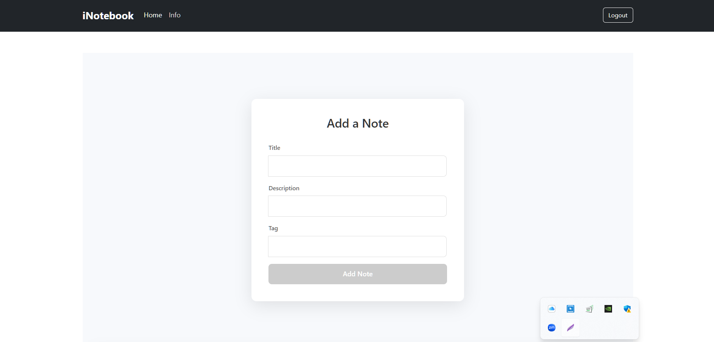
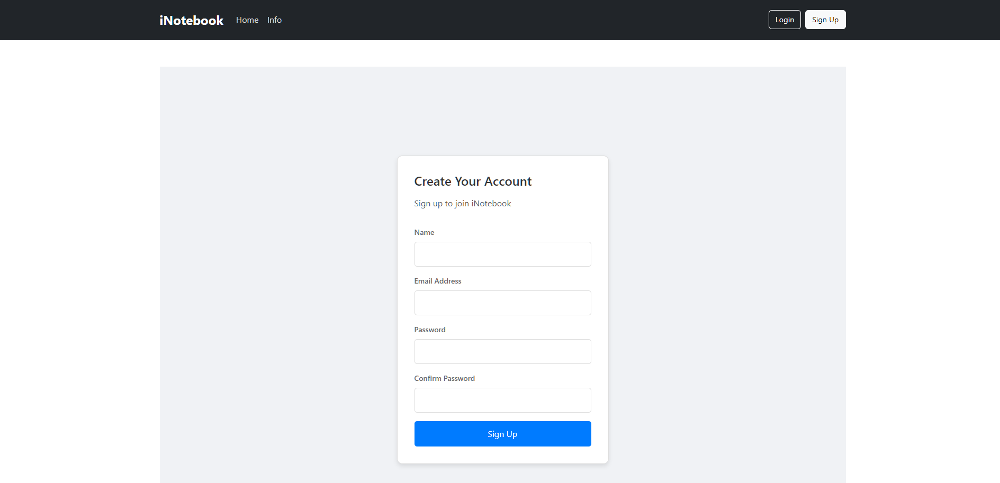
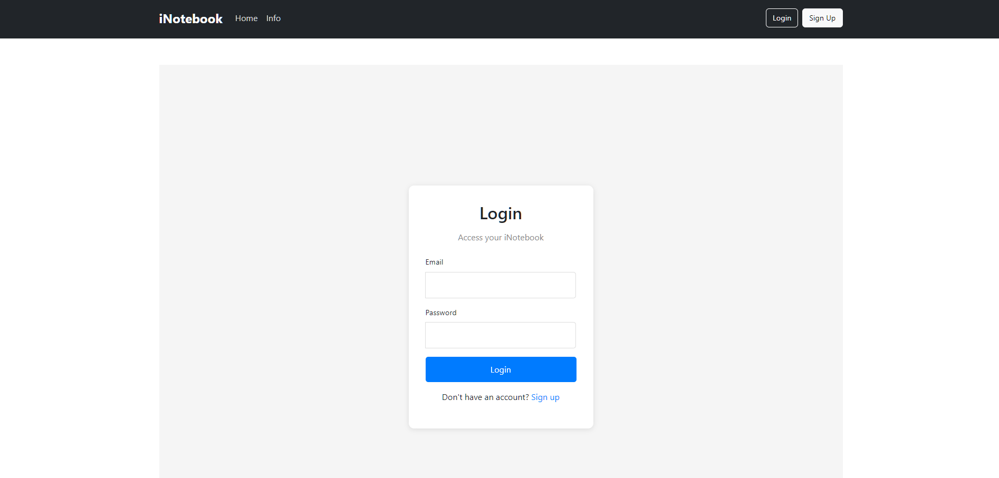

# iNotebook #

Its a notes app built on react to help users manager their task list.

## Features

✅ **User Authentication:** Secure login and account management.
✅ **Notes Management Functionality**: Adding, deleting and editing notes
etc

## Tech Stack

React (Main Front-End Framework)

HTML

CSS

JavaScript

Bootstrap

Backend:- Express

### Databases:
MongoDB

### Additional:
Version Control: GitHub

## Screenshots

